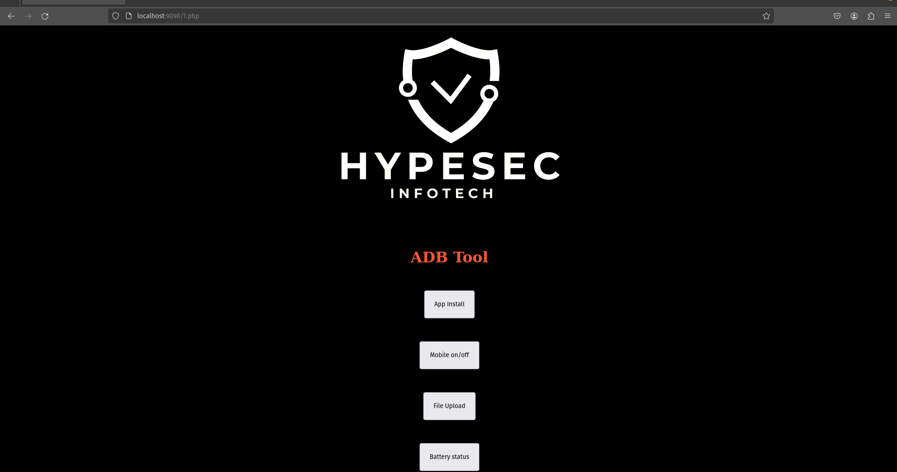

<h1 align="center">Hi 👋, I'm G.Thirumurugan (GT)</h1>
<h3 align="center">A passionate Cyber Tech Reacher from India</h3>
<h1>   web_adb</h1>

Web Based ADB perform...
<h3 align="left">Connect with me:</h3>
<p align="left">
<a href="https://linkedin.com/in/thirumurugan (gtsivam) g" target="blank"></a>
<a href="https://fb.com/gt_sivam" target="blank"></a>
<a href="https://instagram.com/gt_sivam" target="blank"></a>
</p>
## Installation

Install my-project 

```bash
  apt-get install git -y
  git clone https://github.com/GTSivam/Web_adb.git
  cd Web_adb
  chmod 777 install
  chmod 777 run
  sudo ./install
```
## Deployment

To deploy this project run

```bash
  ./run
```
## Screenshots




## Authors

- [@GTSivam](https://github.com/GTSivam)


## Badges

[](https://choosealicense.com/licenses/mit/)
[](https://opensource.org/licenses/)
[](http://www.gnu.org/licenses/agpl-3.0)
